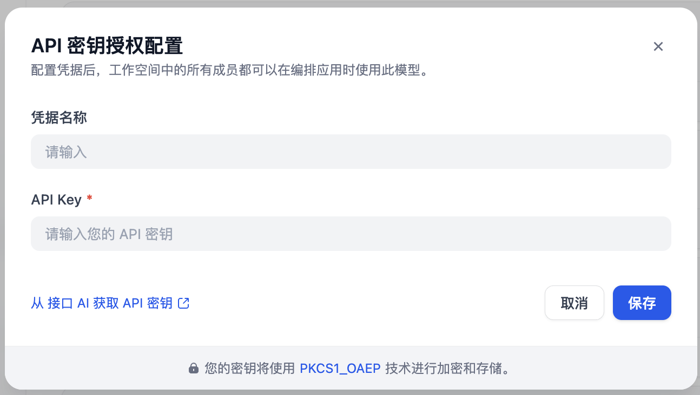
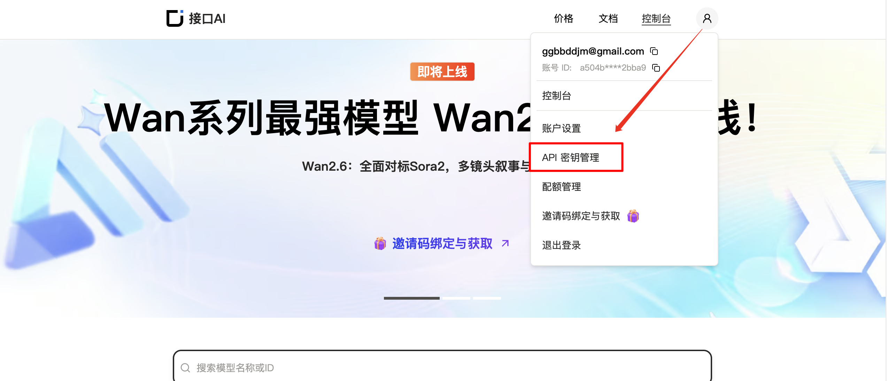
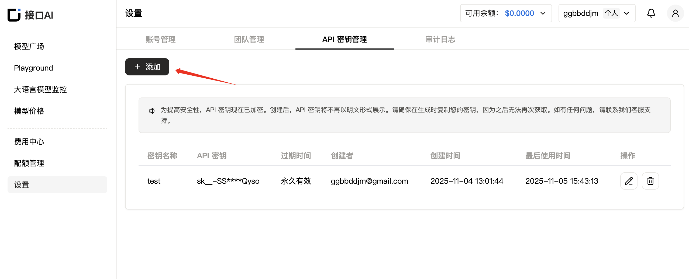

# Overview

Jiekou.AI is an all-in-one platform providing reliable, high-performance large language model API services for businesses. Our solution supports a variety of AI modalities—including natural language, vision, audio, and video—and brings together leading innovations such as OpenAI, Anthropic, Gemini, DeepSeek, Qwen and more. With Jiekou.AI, developers can easily harness the latest advancements in AI technology—no deep machine learning background required.

# Configuration

1. Once the plugin is installed, navigate to the [Settings] page and input your API Key.

2. [Sign up for a Jiekou.AI account.](https://jiekou.ai/user/login?utm_source=github_dify)
3. Generate and store your API key [here](https://jiekou.ai/settings/key-management).
   - Go to [User Avatar] → [API Key Management] to open the console.
     
   - Click **[+ Create]** to generate a new API Key. Give it a custom name, and remember that the key **is shown only once when created** — be sure to copy and store it safely for future access.
     

# Key Features
- **100+ Leading Models**: Explore a wide range of premium models designed for various tasks and industry needs.
- **Optimized Inference Engine**: Achieve faster performance with our proprietary acceleration technology, delivering high throughput and minimal latency.
- **Easy Developer Integration**: Quickly connect AI capabilities to your projects with straightforward API calls and hassle-free setup.
- **Affordable AI Solutions**: Benefit from competitive [pricing](https://jiekou.ai/pricing?utm_source=github_dify) plans built for scalability and cost efficiency.

Source code of this plugin: [https://github.com/captain1379/dify-plugin-jiekou](https://github.com/captain1379/dify-plugin-jiekou)
